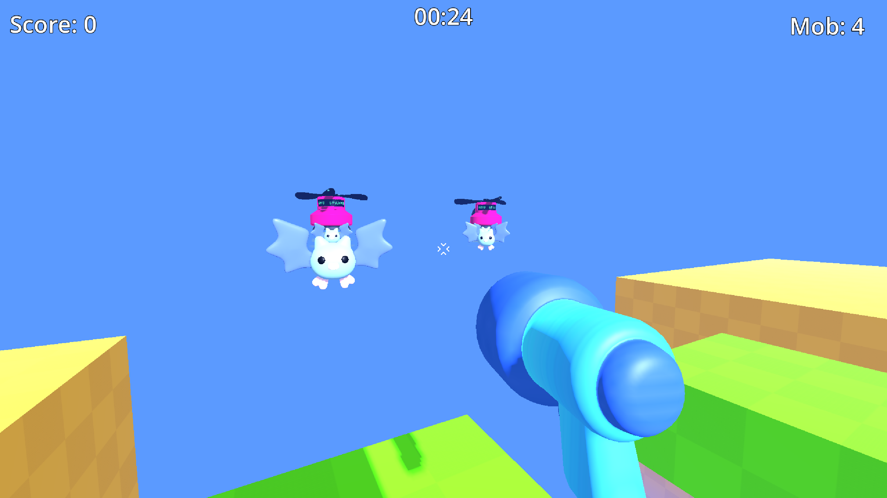

# arena-fps-godot

3D arena shooter — single player mode. Based on [gdquest first_3d_game_godot4_arena_fps](https://www.gdquest.com/library/first_3d_game_godot4_arena_fps/).

<a href="https://pthrrr.github.io/arena-fps-godot/" target="_blank">Play in browser</a>

## Features

- Keyboard + mouse controls
- Bat mobs that chase the player
- 2 mob spawners, max 20 living mobs
- 30-second round timer
- Score tracking, kill plane with respawn
- Smoke puff VFX on mob spawn/death
- Sound effects (shooting, hit, kill)

## Branches

- `main` — single player mode (this branch)
- `two_player_split_screen` — split screen local multiplayer

## Requirements

- Godot 4.6

## Credits

Game assets (3D models, textures, sounds) by [GDQuest](https://www.gdquest.com/), licensed under [CC BY-NC-SA](https://creativecommons.org/licenses/by-nc-sa/4.0/). Code based on their tutorial, licensed under [MIT](https://opensource.org/licenses/MIT).
